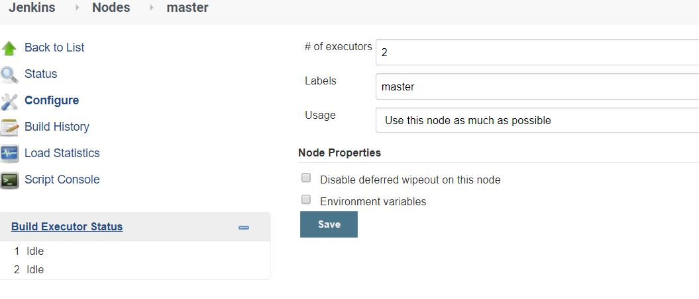
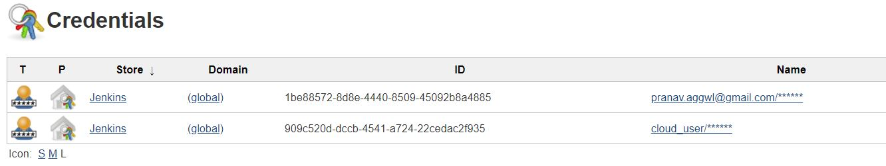
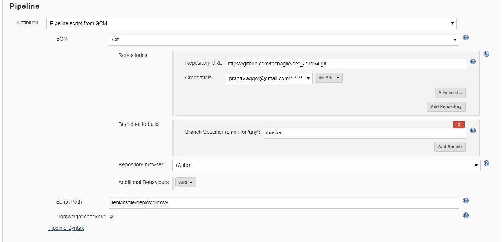
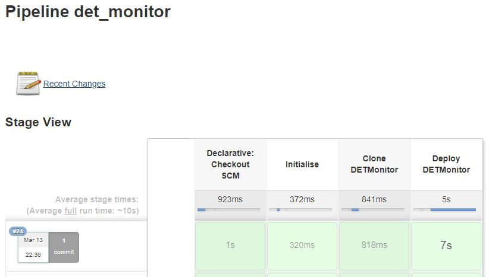
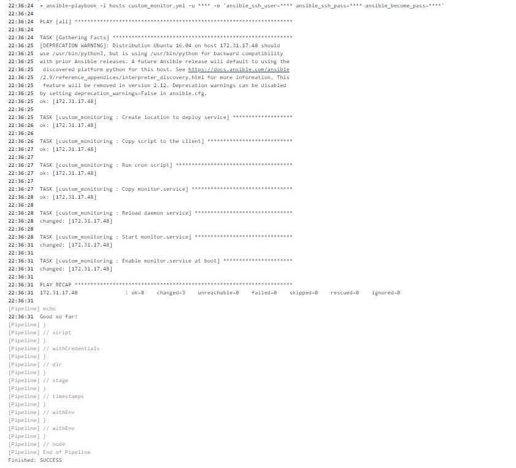

# Project Title

Deploy monitorting service for DevOps. Basically, the project result in setting up a monitoring script that runs at schedule interval, starts on boot, continuously.   

## Prerequisites

Ansible v2.9
Jenkins v2.225
Setup environment variables on Jenkins slave, but this is not required when using LDAP
OPS_USERNAME=<username>
    
OPS_PASSWORD=<password>

### Installing 

+ Setup Jenkins Server

This project use Jenkins server as slave, as well

+ Setup Jenkins slave and label it as 'master'

+ Setup Jenkins Credentials

+ Setup Jenkins Pipeline

+ Setup Linux node to act as client. The client IP is added to the inventory file i.e. ~/hosts
Make sure there is passwordless access to the Linux node. 

## Run the pipeline

As per the Jenkinsfile/deploy.groovy, there are 2 stages, namely:
+ Clone DETMonitor (which clone the artefact i.e. pull from GIT)

+ Deploy DETMonitor (which deploys the artefact on to the clients, which is setup in the ~/hosts file)

+ Pipeline run output

Dependencies
------------

A list of other roles hosted on Galaxy should go here, plus any details in regards to parameters that may need to be set for other roles, or variables that are used from other roles.

Example Playbook
----------------

Including an example of how to use your role (for instance, with variables passed in as parameters) is always nice for users too:

    - hosts: servers
      roles:
         - { role: username.rolename, x: 42 }

License
-------

BSD

Author Information
------------------

An optional section for the role authors to include contact information, or a website (HTML is not allowed).
