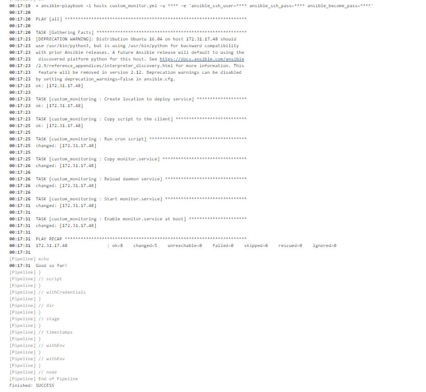
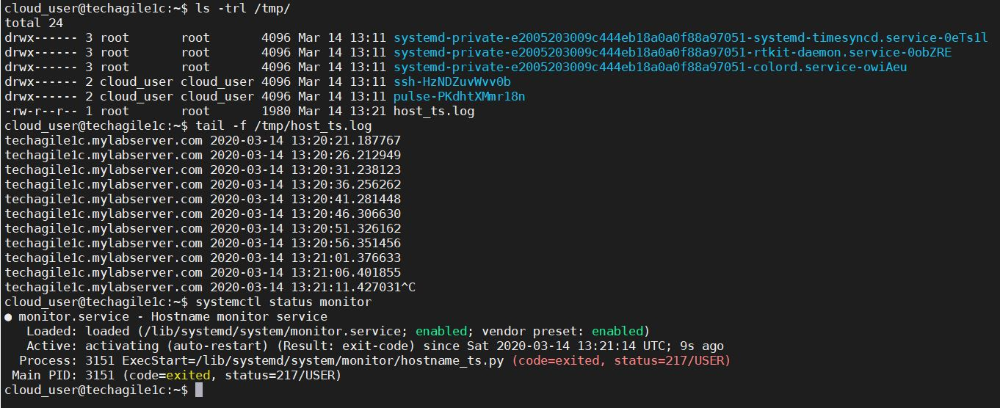

# Project Title

Deploy monitorting service for DevOps. Basically, the project result in setting up a monitoring script that runs at schedule interval, starts on boot, continuously.   


## Prerequisites

Ansible v2.9
Jenkins v2.225
Setup environment variables on Jenkins slave, but this is not required when using LDAP
OPS_USERNAME=<username>
    
OPS_PASSWORD=<password>

### Installing 

+ Setup Jenkins Server

This project use Jenkins server as slave, as well

+ Setup Jenkins slave and label it as 'master'


+ Setup Jenkins Credentials


+ Setup Jenkins Pipeline


+ Setup Linux node to act as client. The client IP is added to the inventory file i.e. ~/hosts
Make sure there is passwordless access to the Linux node. 

## Run the pipeline

As per the Jenkinsfile/deploy.groovy, there are 2 stages, namely:
+ Clone DETMonitor (which clone the artefact i.e. pull from GIT)

+ Deploy DETMonitor (which deploys the artefact on to the clients, which is setup in the ~/hosts file)


+ Pipeline run output


+ DevOps monitoring output


Caveat
------------

Basically, the role confirms to:
+ run the service as daemon [done]
```
monitor.service - Hostname monitor service
   Loaded: loaded (/lib/systemd/system/monitor.service; enabled; vendor preset: enabled)
```
+ fails after 3 restart attempts, as per the monitor.service i.e. StartLimitBurst=3 [done]
```
[Unit]
Description=Hostname monitor service
After=network.target
StartLimitBurst=3
StartLimitInterval=10
```

- Auto start on boot [missing]

Though the service is set to auto-restart on boot, but confirmed that the service isn't picking up on reboot. 

- Service to run as non-priviledged user [missing]

Initially the service was setup to run as non-priviledged user via; and it was working well. But later changed to the current state. Need further investigation to get this, sorted. 
```
- name: Reload daemon service
  command: "systemctl --user daemon-reload"

- name: Start monitor.service
  command: "systemctl --user start monitor"

- name: Enable monitor.service at boot
  command: "systemctl --user enable monitor"
```
